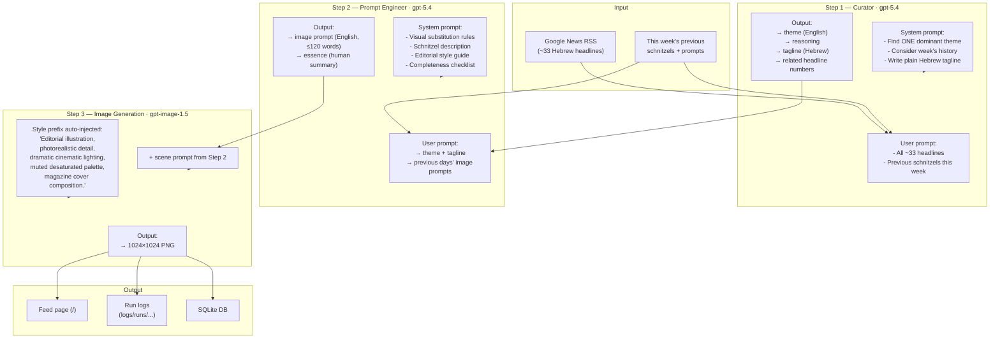

# שניצל.ai

AI-powered satirical news site that generates one schnitzel-themed editorial image per day, capturing the essence of the news cycle. שניצל בצורה של החדשות.

**Live:** https://shnitzelai.fly.dev

## How it works

One image per day. The pipeline reads the news, picks the dominant story, crafts a prompt, and generates an editorial illustration where one element is subtly replaced by a schnitzel.



### What each prompt contains

| Step | System prompt includes | User prompt includes |
|------|----------------------|---------------------|
| **Curator** | How to pick ONE theme; novelty/importance/visual criteria; tagline rules (plain Hebrew, max 10 words, no schnitzel) | All ~33 RSS headlines; this week's previous schnitzels (theme + tagline) |
| **Prompt Engineer** | Visual substitution technique; schnitzel physical description; completeness checklist (actors, symbols, setting, objects); editorial tone guide; prompt format rules (≤120 words, no negations) | Today's theme + tagline; previous days' full image prompts (last per day, 7 days) |
| **Image Model** | — | Auto-prepended style prefix + scene prompt from Step 2 |

### Key creative rules baked into the prompts

- **Visual substitution**: the schnitzel *replaces* one flat object in the scene (map, portrait, document, flag) rather than sitting on a plate as a prop
- **One substitution per image**: a single "wait, is that a schnitzel?" moment
- **Real people and symbols**: Trump, Bibi, Putin shown as themselves; faction flags, landmarks, and settings ground the image in reality
- **Vary the technique**: the prompt engineer sees previous days' prompts to avoid repeating the same trick
- **Adult tone**: dark, dry, understated — not cartoon or slapstick

## Quick start

```bash
pnpm install
cp .env.local.example .env.local  # add your OPENAI_API_KEY
pnpm dev                           # http://localhost:3000
```

Visit `/admin/generate` to preview and generate today's schnitzel.

## Project structure

```
src/
├── app/
│   ├── page.tsx                    # Feed (RTL Hebrew, dark theme)
│   ├── admin/generate/page.tsx     # Admin: preview → confirm flow
│   └── api/
│       ├── generate/
│       │   ├── preview/route.ts    # Step 1+2 (cheap LLM calls)
│       │   ├── confirm/route.ts    # Step 3 (image generation)
│       │   └── route.ts            # Full pipeline (used by cron)
│       ├── news/route.ts           # GET feed data
│       ├── cron/route.ts           # Manual cron trigger
│       └── health/route.ts
├── lib/
│   ├── ai/
│   │   ├── prompts.ts              # All system prompts + prompt builders
│   │   ├── pipeline.ts             # 3-step orchestration + run logging
│   │   ├── registry.ts             # Provider/model config
│   │   └── providers/              # OpenAI, Google, BFL implementations
│   ├── db/                         # SQLite (better-sqlite3)
│   ├── news/fetcher.ts             # Google News RSS parser
│   ├── cron/scheduler.ts           # Daily 9am via croner
│   └── logger/
│       ├── index.ts                # Stdout logger
│       └── run-log.ts              # Per-run file logging
└── components/                     # Feed cards, admin form
```

## Run logs

Every pipeline run is logged to `logs/runs/<timestamp>_<ulid>/` with:
- `steps/0_headlines.json` — all RSS headlines + week history
- `steps/1_curate_input.txt` / `1_curate_output.json` — curator prompts and response
- `steps/2_prompt_input.txt` / `2_prompt_output.txt` — prompt engineer I/O
- `steps/3_image_meta.json` — model, quality, timing
- `image.png` — copy of generated image
- `run.json` — full summary with timings

`logs/index.jsonl` has one-line summaries for quick scanning.

## Deployment

Currently deployed on Fly.io with a persistent volume for SQLite + images:

```bash
flyctl deploy --remote-only -a shnitzelai    # deploy
pnpm sync:all                                 # push local images + DB to remote
```

## Authors

Jonathan Zarecki, Matan Kalp, Yoav Halperin
